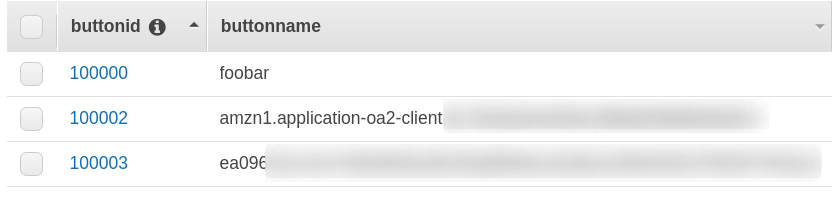
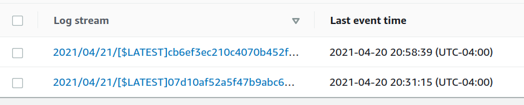
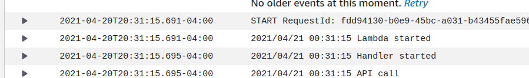

## Prerequisites

In order to create a Smart skill you need an Alexa Developer Account.  If
you don't have one you can [create one here](https://developer.amazon.com/en-US/docs/alexa/ask-overviews/create-developer-account.html).   This is free.
For simplicitly you should use the same email address as you use with your
Alexa devices, which is probably your Amazon shopping login email.

You also need an AWS Cloud Account.  This is also free.  They'll ask for
a credit card but it won't be charged unless you exceed the free tier.
This can take a while.  Account creation can be done [here](https://aws.amazon.com).  The email address you use is considered the _root_ login for AWS and
has total privileges.  If you get logged out (session timeout) and need
to login again remember to click on the "root account" option.  This email
address doesn't need to be the same as your Alexa/Amazon login; you can pick
another one if you wish, or you can use your Amazon.com details.  

The Cloud account may not be created straight away; be patient.  There's a
lot more you can do once you've got your account (e.g. create an "IAM"
user and use that to login) but this isn't an Amazon tutorial.

[Amazon](https://developer.amazon.com/en-US/docs/alexa/smarthome/steps-to-build-a-smart-home-skill.html) document the high levels, which is what I based
a lot of these instructions on.

Now there some question in my mind as to what _region_ a skill should be
deployed in.  The [Amazon documentation](https://developer.amazon.com/en-GB/docs/alexa/custom-skills/host-a-custom-skill-as-an-aws-lambda-function.html#select-the-optimal-region-for-your-aws-lambda-function) says

| Location | Deploy Region | Region Name |
| -------- | ------------- | ----------- |
| NA | us-east-1 | US East (N. Virginia) |
| EU or IN | eu-west-1 | EU (Ireland) |
| Far East | us-west-2 | US West (Oregon) |

If you deploy to these regions things should "just work".  If you deploy
to another region then see later around API regional endpoints.

I deployed to us-east-1 (North Virginia). 

This will impact the deployment of DynamoDB and the Lamba skill, and
maybe also the API Gateway.  When you get to the "AWS Console" part of
the instructions, le you can select your region from the top bar menu,
on the right.

## Installation

Now this is pretty complicated.  It's a _lot_ of steps and jumping around in
both the Alexa Developer portal and the AWS service console.

There is a blank [Numbers.txt](Numbers.txt) file which will help you
record all the "magic numbers" that will be needed as we go through
this process.

*Be very careful with cut'n'pasting; additional whitespace may cause things not to work, especially in IDs and secrets.*

### Set up a "Login with Amazon" security profile

Go to the [LWA Developer Portal](https://developer.amazon.com/loginwithamazon/console/site/lwa/overview.html)
* Click on the "Create New Security Profile" button.<br>
The values you enter here aren't so important.
  * For the profile name I picked "Smart Home"
  * For the description I picked "Allow connection from Alexa Virtual Button"
  * For the Consent URL I picked `https://example.com/privacy.html`
  * I uploaded my standard icon for the Logo
* Take note of the Client ID.  It will look like `amzn1.application-oa2-client.################################`
* Take note of the Client secret.  It will look like `0123456789abcdef0123456789abcdef0123456789abcdef0123456789abcdef`

### Create the Skill definition.

Go to the [Alexa Developer Portal](https://developer.amazon.com/alexa/console/ask)

* Click on Create Skill.
  * For the skill name I chose "Smart Home Virtual Buttons".
  * The language should be the language you have your Echo devices set to.
  * For the model select "Smart Home".<br>
This should also automatically select "Provision your own" as the hosting method.
* Once the form is filled out, click on the "Create Skill" button at the
top.
* On the next page keep the Payload version at 3.
  * Take a note of the Skill ID.  It will look something like `amzn1.ask.skill.########-####-####-####-############`.

We can't yet fill in the Default Endpoint value because we haven't defined
the skill yet.  We'll come back to this later.

* On the left click on the "PERMISSIONS" tab
  * Turn _on_ the "Send Alexa Events" option.  This is required to let us trigger routines.
  * Take a note of the Client ID.  It will look something like `amzn1.application-oa2-client.################################`.
  * Take a note of the Client Secret.  It will look something like `0123456789abcdef0123456789abcdef0123456789abcdef0123456789abcdef`

* Click on the "ACCOUNT LINKING" tab.
  * The Authorization URI should be set to `https://www.amazon.com/ap/oa`
  * The Access Token URI should be set to `https://api.amazon.com/auth/o2/token`
  * The Client ID should be the "Login with Amazon Client ID" that we got from setting up the security profile
  * The Client Secret should be the "Login with Amazon Client Secret" that we got from setting up the security profile
  * Leave the Scheme as "HTTP (Basic)
  * For the scope, add a value of `profile:user_id`

* Take a note of the 3 Redirect URLs.  It will look something like `https://layla.amazon.com/api/skill/link/ABCDEFGHIJKLMN`.  Copy all three of them.

* Click the SAVE button.

At this point we've done all we can for the Alexa side (except the Endpoint
definition).

### Finish configuring the LWA Security Profile

We need to add those Redirect URLs to the security profile,

* Go to the [LWA Developer Portal](https://developer.amazon.com/loginwithamazon/console/site/lwa/overview.html).
* Under "Manage" select "Web Settings"
* Click "Edit"
* Now enter the 3 Redirect URLs into the "Allowed Return URLs" area.
* Save the changes

### Set up the AWS "IAM" Policy

Go to the [AWS Console](https://console.aws.amazon.com/console/home)

This page is a little complicated; there's lots of services.  There's
a search option to help you find them.  It will also remember "recent"
services on the left, which can help you move between the pages.

* From the Services menu select "IAM"
* On the "Polices" tab we need to "Create" a new policy.
* On the create screen switch to the "JSON" tab and paste this in:

```
{
    "Version": "2012-10-17",
    "Statement": [
        {
            "Effect": "Allow",
            "Action": [
                "dynamodb:*",
                "logs:CreateLogStream",
                "logs:CreateLogGroup",
                "logs:PutLogEvents"
            ],
            "Resource": "*"
        }
    ]
}
```
This will allow writing of log messages to CloudTrail and to read/write
from DynamoDB.  It's probably a little excessive for DynamoDB, but it
should work.

* Click "Next: Tags" (we don't need any tags) and then "Next: Review".
  * At this point give a descriptive name; I used "Smart_Home_Virtual_Buttons" to make it clear what this policy will be used for.

* Now click "Create Policy".

### Set up the AWS "IAM" Role

* We're still in the IAM service, so now click on the "Roles" tab on the left.
* We need to "Create Role".
* Under "Common use cases" click on the "Lambda" option
* Click on "Next: Permissions"
* Here we select the policy we just defined ("Smart_Home_Virtual_Buttons" in my case).
* Again, click through Tags and onto Review. 
  * I gave the Role the same name ("Smart_Home_Virtual_Buttons") so it's clear they're all linked.

### Create the DynamoDB table.

* On the main Services menu, select DynamoDB
* Click on "Create Table"
* The name to use is "Smart_Home_Virtual_Buttons".  If you change this
then you'll need to modify the code (`dynamo.go`) definition.
* The Primary Key is "buttonid" and it must be type "Number".
* Unclick "use default settings".
* Ensure the capacity is set to "Provisioned (free tier)"
* Turn _off_ autoscaling
* Ensure the "Encryption at rest" is set to "DEFAULT"
* "Create" the table!

### Clean up some CloudTrail/SNS stuff (optional)

Creating that table will have set up some default alerting rules.  We
don't need these.  If you keep them you won't be charged, but we might
as well clean up.

* From the Services menu select Simple Notification Service (SNS)
* On the Topics page you'll see an entry for "dynamodb".  You can delete this
* From the Services menu select Cloudwatch.
* On the Alarms page you'll see two alarms relating to Capacity.  You can delete both of them from the "Actions" dropdown menu.

### Create the Lambda function.

Finally!


* From the Services menu select Lambda
* Create function.
* Author from Scratch
  * For the function name I, again picked "Smart_Home_Virtual_Buttons"
  * For the runtime select "Provide your own bootstrap on Amazon Linux 2"
  * Architecture should be "x86_64"
  * For the default execution role select the one we created earlier (which
I called "Smart_Home_Virtual_Buttons"; consistency is nice!)
  * Click on Create Function

* Now take note the ARN.  This is what we need to plug into the Alexa Skill
* Click on the "Upload from" and upload the `lambda.zip` file.
* In the "Runtime settings" click on "edit" 
  * ensure the Runtime is set to "Custom runtime for Amazon Linux 2"
  * ensure the "Handle" value to "bootstrap" (this may not be necessary, but better safe...).<br>This is the name of the program inside the zip file we just uploaded.
  * Save that

* Click on the "Configuration" tab
  * Click on "EDIT" for the "General configuration"
  * Set Memory to 128 (the smallest it allows)
  * Set Timeout to 3 seconds
  * Save that

### Add a API Gateway trigger

* Click on Add trigger, and select "API Gateway"
* API type is "HTTP API"
* Security is "Open"
* Click Add

On the results page you can look at the details of the API endpoint
and get the API Endpoint URL.
* Note the Endpoint URL<br>
It will look something like
`https://abcdefhioj.execute-api.us-east-1.amazonaws.com/default/Smart_Home_Virtual_Buttons`.

Now the "Open" security means that anyone who knows this string will be
able to reach your endpoint.  They won't be able to _do_ anything because
we will password protect the site, but they will be able to cause API
requests to occur and that will be counted as part of the $1/million
calls.  So keep this secret!

Now for a sanity check, we need to ensure the API version is set to
version 2.0.  In my deployments it was that, but others
have reported it defaults to 1.0.  Maybe something changed in the
trigger setup...

So from the lambda overview, click on the API Gateway and select the API
trigger.  This will take you to the "API Gateway" configuration page.  On
the left menu select "Integrations", and then select the "ANY" route.
You will now see a "Payload format version" definition.  If it says
1.0 then edit the setting ("manage"/"edit"/"advanced") and change it
to 2.0.

### Set security on the API

To prevent abuse (making Alexa talk all the time) we should set a password.

At the same time we can set the security parameters needed allow the skill
to be linked to Alexa and make announcements.

We can do this via the API itself or we can do it via the DynamoDB console

#### Via the API (preferred)
```
curl https://abcdefghij.execute-api.us-east-1.amazonaws.com/default/Smart_Home_Virtual_Buttons -d '{"command":"setpasswd", "param1":"foobar"}'
```

This should respond `{"Answer:":"foobar"}`.  If it does then we've set the
password to "foobar".  Obviously pick a password you want!

If you now look at the DynamoDB table you'll see an item has been populated;
buttonid 100000 with the buttonname value being your password.

This demonstrates the API Gateway is working.

Now we can set the remaining values, using this new password.  Note the
new password is in an "Authorization" head.

We need to run the "setclientid" command with the "Alexa Client ID" and the
"setclientsecret" with the "Alexa Client Secret" values.

```
% curl -H "Authorization: foobar" https://abcdefghij.execute-api.us-east-1.amazonaws.com/default/Smart_Home_Virtual_Buttons -d '{"command":"setclientid", "param1":"amzn1.application-oa2-client.################################"}'
{"Answer:":"amzn1.application-oa2-client.################################"}
curl -H "Authorization: foobar" https://abcdefghij.execute-api.us-east-1.amazonaws.com/default/Smart_Home_Virtual_Buttons -d '{"command":"setclientsecret", "param1":"0123456789abcdef0123456789abcdef0123456789abcdef0123456789abcdef"}'
{"Answer:":"0123456789abcdef0123456789abcdef0123456789abcdef0123456789abcdef"}
```

This will create buttonids 100001 and 100002 in DynamoDB

#### Via the console

* From the AWS console select the DynamoDB option, select Tables, select
the table you created.
* Click on the Items tab.
* Click on create item

Now this is where it gets a little tricky

* For the buttonid enter 100000
* Click the + sign, "Append", "String'
* On the new row type "buttonname" as the field name and put your password in as the value

Now do the same for buttonid 100002 and enter the previously saved "Alexa Client ID", and then for buttonid 100003 and enter the previously saved "Alexa Client Secret".

The resulting table should look like something like:



### API regional endpoints.

Depending on the region you deploy to, the API endpoint the skill needs
to send data to to alert on button changes is different.  If you pick
one of the three standard regions then the code should automatically
pick the right endpoint

| region | endpoint |
| ------ | -------- |
| us-east-1 | North America: https://api.amazonalexa.com/v3/events |
| eu-west-1 | Europe: https://api.eu.amazonalexa.com/v3/events |
| us-west-2 | Far East: https://api.fe.amazonalexa.com/v3/events |

If you deploy to a different region then you can define button 100005
to contain the API endpoint to talk to.  This can be done with the
`setendpoint` command, or via the GUI

```
% curl -H "Authorization: foobar" https://abcdefghij.execute-api.us-east-1.amazonaws.com/default/Smart_Home_Virtual_Buttons -d '{"command":"setendpoint", "param1":"https://api.amazonalexa.com/v3/events"}'
{"Answer:":"https://api.amazonalexa.com/v3/events"}'
```

### Create the Alexa Trigger

From the services menu go back to Lambda and select the function we just
defined.

* Click on Add Trigger
* Select "Alexa Smart Home"
* Enter the Alexa Skill ID we previously saved
* Click create.

### Hook up the Lambda to Alexa

* Go back to the [Alexa Developer Portal](https://developer.amazon.com/alexa/console/ask)
* Select the skill we'd defined.
* Now on the SMART HOME tab enter the AWS Lambda ARN value we saved.
* SAVE

### Add the skill to your Alexa.

This needs to be done from the Alexa App on your smart phone

* Open the App
* Select the "Skills and Games" menu option.
* Select "Your Skills"
* Now you should see a "Dev" tab; these are the skills you've developed
so click on that.
* Your "Smart Home Virtual Buttons" skill should now be listed, along with a warning "Account linking required"
* Click on the skill, then click ENABLE

This should(!) take you to an Alexa login page; login there with your normal
Alexa (Amazon.com) username and password.

### What if it fails

The lambda function writes out various messages to CloudTrail while it is
working, so you can select the "Cloud Trail" service, select the Log Groups
option and then select our skill.

You might see multiple streams because AWS frequently rotates them.



Pick the one you want to look at.

Now when the lambda starts it logs the fact and reports on the _type_ of
request it's handling.	

Here we can see it says "API call".  This means it's handling a HTTP API
request.  If this was a Alexa Smart Home call then it would say "Alexa call".



If you don't see _any_ activity then it means you haven't set the triggers
up properly.  Maybe there's a miscopied magic number?  Check them all
carefully.  If you made a mistake with permissions then you might see
an error in here (e.g. DynamoDB errors).

Or you might have missed a step.  In this example I got an error trying to
link the skill... because I missed out setting the clientid/clientsecret!


### Done!

You've now created your Smart Home Skill and linked it to your Alexa account.

That was hard work, but you should only need to do it the once!

